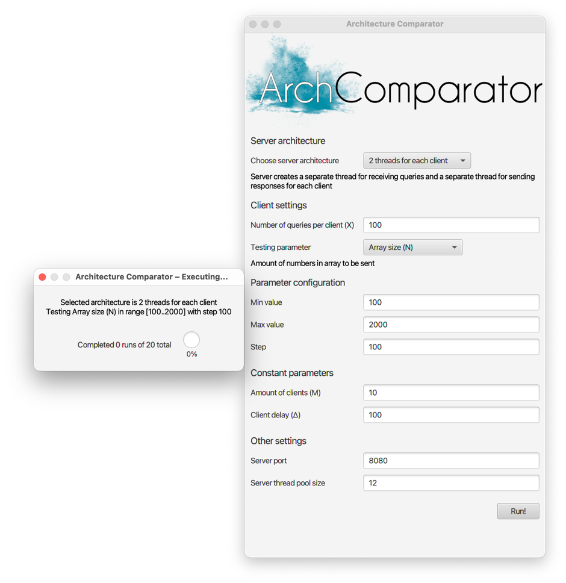

# Architecture Comparator

Зачётное задание для курса по Java.

Приложение сравнивает популярные архитектуры серверов:
* Когда для каждого клиента создаётся поток-читатель и 
  поток-писатель
* Неблокирующую архитектуру
* Асинхронную архитектуру

> Анализ полученных данных находится в 
> [charts/Charts.md](charts/Charts.md)

Сравнение производится по следующим параметрам:
* Среднее время, затраченное на выполнение задания сервером
* ???
* Среднее время работы клиента

Параметры, которые можно задавать для тестирования:
* Количество одновременно подключенных клиентов (M)
* Количество элементов в сортируемых массивах (N)
* Временной промежуток от получения ответа от сервера на 
  одно сообщение клиента до начала отправки следующего 
  сообщения клиента (∆)
* Суммарное количество запросов, отправляемых каждым 
  клиентом (X)

В ходе тестирования один из параметров линейно, с заданным 
шагом изменяется от минимального до максимального значения.
